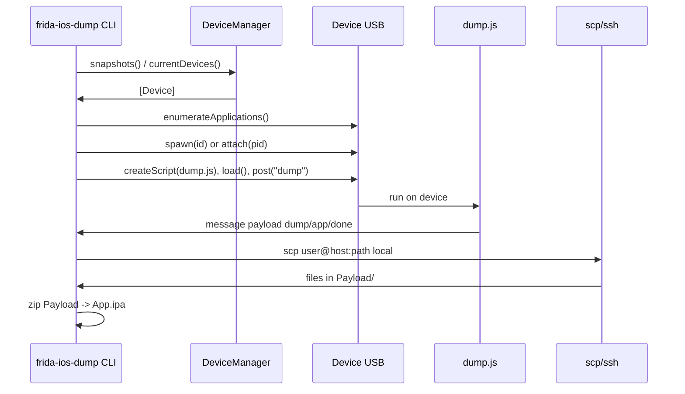

# ADR 0001: Host (Swift) ↔ device (dump.js) communication via Frida messages

## Status

Accepted.

## Context

We need to dump decrypted binaries from an iOS app running on a jailbroken device. The dump logic must run **inside** the app process (to read decrypted memory and file layout). The host (Mac) only has:

- A **Frida** connection to the device (USB), so we can attach to the app and run a script inside it.
- **SSH/SCP** to the device (e.g. via `iproxy 2222 22`), so we can copy files from the device to the host.

So we split responsibilities:

- **On the device:** A Frida script (`dump.js`) runs in the target app. It dumps decrypted modules to files (e.g. in the app’s Documents directory) and sends **paths** back to the host.
- **On the host:** A Swift CLI uses the **frida-swift** bindings to discover the device, attach (or spawn) the app, load `dump.js`, and react to **messages** from the script. For each path received, the host runs **SCP** to copy that path from the device into a local `Payload` directory, then builds the `.ipa` with `zip`.

Frida’s **session** and **script** APIs give us a channel: the script can call `send(payload)` and the host receives **script events** (e.g. `Script.Event.message(message, data)`). The host can call `script.post("dump")` to tell the script to start the dump. So the protocol is: host loads script → host posts `"dump"` → script runs, sends a series of messages with paths and a final `"done"` → host fetches each path via SCP and then builds the IPA.

## Flow (didactic)

### 1. Host discovers the USB device and the app

- The Swift CLI creates a **DeviceManager** (frida-swift) and consumes **snapshots** of devices.
- It filters for a device with `kind == .usb` (and optionally waits until one appears).
- It calls **device.enumerateApplications()** to get a list of installed apps (identifier, name, pid).
- For **list** mode (`-l`), it prints this list and exits.
- For **dump** mode, it finds the app whose `identifier` or `name` matches the user’s target.

### 2. Host attaches to (or spawns) the app

- If the app is already running (`pid != nil`), the host calls **device.attach(to: pid)** to get a **Session**.
- If not, it calls **device.spawn(identifier)**, then **device.attach(to: pid)** and **device.resume(pid)** so the app starts with Frida attached.
- All further work uses this **Session**.

### 3. Host loads the dump script and starts it

- The host reads the **dump.js** source (from the app bundle, executable directory, or current directory).
- It creates a script with **session.createScript(source)** and **script.load()**.
- It starts a **Task** that iterates over **script.events** (e.g. `for await event in script.events`) and, for each **.message** event, parses the payload and reacts (see below).
- It then calls **script.post("dump")** so the script begins the dump loop.

### 4. Script runs on the device and sends messages

- The script (running inside the app process) enumerates modules, dumps each decrypted binary to a file (e.g. in Documents), and for each dump calls **send({ dump: resultPath, path: originalPath })**.
- Then it sends **send({ app: appPath })** with the path of the `.app` bundle.
- Finally it sends **send({ done: "ok" })** to signal completion.

### 5. Host reacts to each message type

- **Payload with `dump` and `path`:** The host runs **SCP** to copy `remotePath` (the dump file) into the local **Payload** directory. It stores a mapping from the basename of the dump to the relative path inside the `.app` (derived from `path`), for later IPA layout.
- **Payload with `app`:** The host runs **SCP** recursively to copy the whole `.app` directory into Payload, and records its basename as the “app” entry in the file mapping.
- **Payload with `done`:** The host sets a “done” flag. The main flow was waiting (with a timeout, e.g. 600s) for this flag; once set, it stops listening and proceeds to build the IPA.

### 6. Host builds the IPA

- Using the stored mapping, the host moves each dumped artifact into **Payload/<AppName>/<relativePath>** (so the layout matches a valid .app structure).
- It runs **zip -qr <name>.ipa Payload** in the temp directory and writes the `.ipa` to the current working directory.

## Message format

Messages from the script are delivered by Frida as a dictionary. Typically:

- **Type wrapper:** `{ "type": "send", "payload": <object> }`. The host uses the **payload** object.
- **Payload objects** sent by our script:
  - **Dump:** `{ "dump": "<device path to .fid file>", "path": "<original path inside .app>" }`
  - **App:** `{ "app": "<device path to .app>" }`
  - **Done:** `{ "done": "ok" }`
- **Logs:** `{ "type": "log", "payload": "<string>" }` — optional; host can print with `[device]` prefix when `-v` is set.

Example (conceptual):

```json
{ "type": "send", "payload": { "dump": "/var/.../Documents/MyApp.fid", "path": "/var/.../MyApp.app/MyApp" } }
{ "type": "send", "payload": { "app": "/var/.../MyApp.app" } }
{ "type": "send", "payload": { "done": "ok" } }
```

## Diagram



## Decisions

### Why keep the dump logic in JavaScript on the device (and not reimplement in Swift on the host)?

- The **decryption and layout** of Mach-O segments, and the exact file paths inside the app, are only available **inside** the process. Frida’s engine runs JavaScript (or other runtimes) inside that process and can call native APIs (e.g. `open`, `read`, ObjC) and read memory. The host cannot perform the same work without reimplementing the entire dump and encryption logic and having a way to read process memory from the host, which would be more complex and duplicate the battle-tested logic of the original dump.js.

### Why use SCP via Process (and not an SSH/SCP library in Swift)?

- Using the system **scp** (and optionally **sshpass** for password) keeps the project free of extra native dependencies and works with the user’s existing SSH setup (keys, agent, or password). A pure-Swift SSH/SCP library would add dependency and maintenance cost without a clear benefit for this use case.

## References

- Original frida-ios-dump (Python): [AloneMonkey/frida-ios-dump](https://github.com/AloneMonkey/frida-ios-dump)
- Frida: [frida.re](https://frida.re/)
- frida-swift: [frida/frida-swift](https://github.com/frida/frida-swift)
